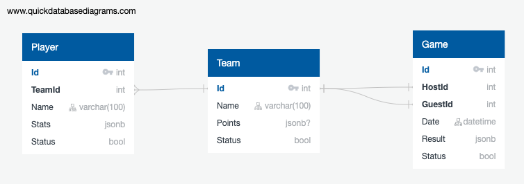

# CartHookAssignment

## A

### Task
Design a SQL database to store NBA players, teams and games (column and table contents are all up to you). Users mostly query game results by date and team name. The second most frequent query is players statistics by player name.

### Solution

Sql in `NBA.sql`